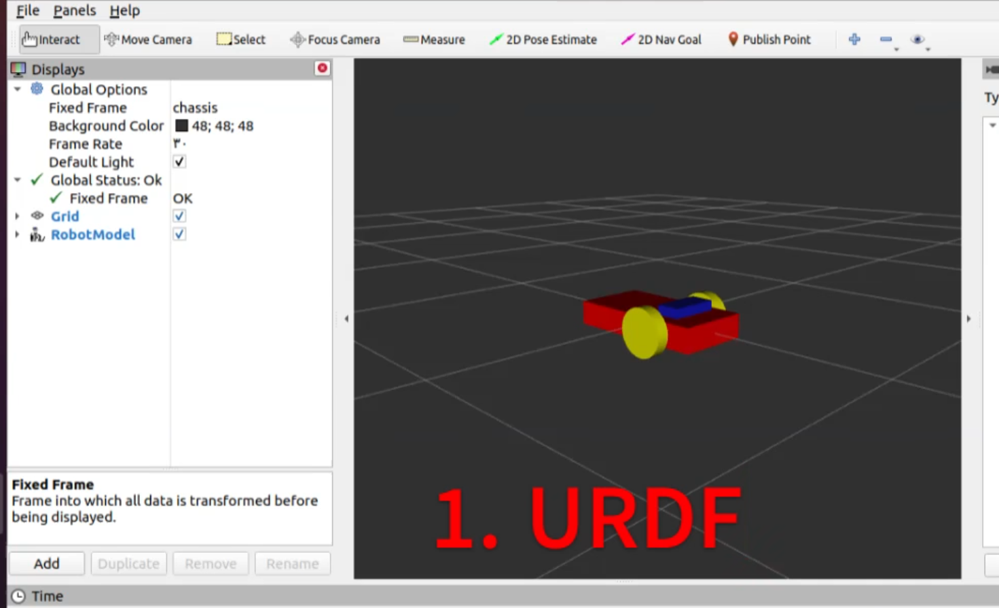
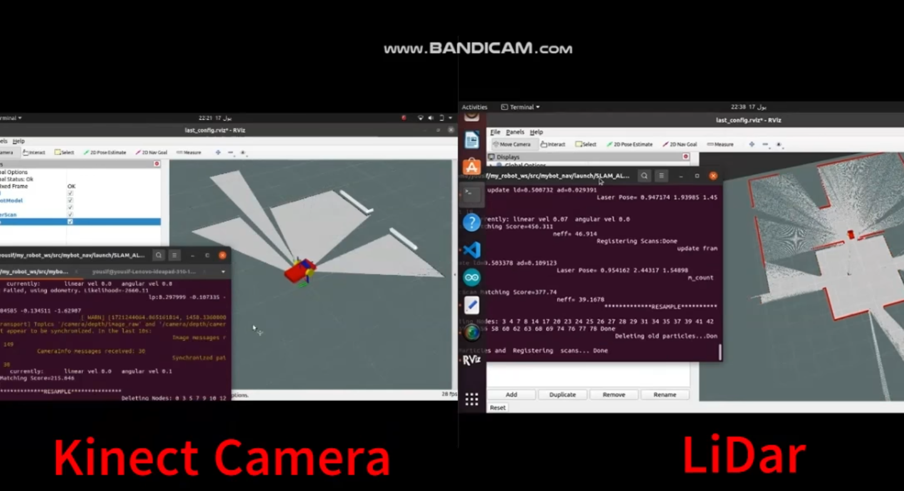
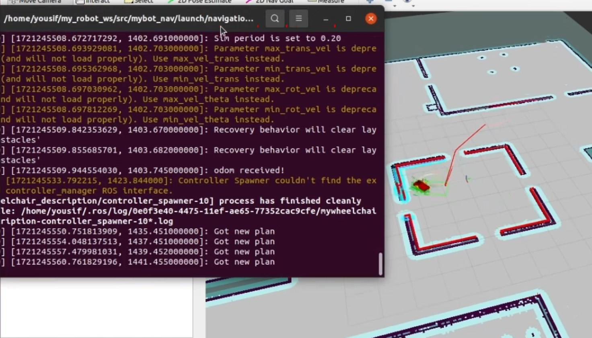

# 🤖 Autonomous Mobile Robot (AMR) – Simulation Only

This project simulates an **Autonomous Mobile Robot (AMR)** using **ROS (Robot Operating System)** and **Gazebo**, focusing on robot modeling, SLAM, and autonomous navigation.

---

## 🛠️ Project Overview

The AMR was built and tested entirely in **simulation**. It uses a custom robot model created with **URDF**, and integrates multiple sensors to explore autonomous capabilities.

Key components include:

- **URDF Modeling** – defines the robot’s physical properties and sensor placements
- **GMapping Algorithm** – performs SLAM using two different sensors:
  - **Kinect** (180° FOV)
  - **LIDAR** (360° FOV)
    > 🔍 Explores the differences in mapping performance between Kinect and LIDAR

- **MoveBase Package** – handles autonomous navigation:
  - **A\*** algorithm for global path planning
  - **DWA (Dynamic Window Approach)** for local obstacle avoidance
- Parameter tuning for accurate path planning, smooth motion, and safe navigation

---

## 🖼️ Screenshots

### URDF Model

### Mapping in Gazebo

### Autonomous Navigation

---

## 🔧 Technologies Used

- **ROS Noetic**
- **Gazebo Simulator**
- **URDF / xacro**
- **GMapping**
- **RViz**
- **MoveBase**
- **A\*** & **DWA Planners**

---

## 🧠 Learning Outcomes

- Understanding the impact of different sensor configurations on mapping
- Hands-on experience with:
  - Robot modeling
  - SLAM techniques
  - Autonomous path planning
  - Parameter tuning for navigation
- Insights into real-world robotic challenges, even in simulation

---

## 🔗 Related Projects

- [🦽 Self-Driving Wheelchair (Simulation & Real)](https://github.com/YoussefAdel170/Autonomous-Wheelchair)

---

## 🎥 Demo

**Watch a live demo of the AMR Simulation:**  
[LinkedIn Video](https://www.linkedin.com/posts/youssef-adel-a601641b1_autonomousrobots-pathplanning-ros-activity-7235637954805723136-xoy-?utm_source=share&utm_medium=member_desktop&rcm=ACoAADFSougBbplLvCFvoq2oVcM3uoEe_eK2zig)

---

## 📜 License

This project is open-source under the [MIT License](LICENSE).

---

## 🙋‍♂️ Author

**Youssef Adel** – [LinkedIn](https://www.linkedin.com/in/youssef-adel-a601641b1/)
